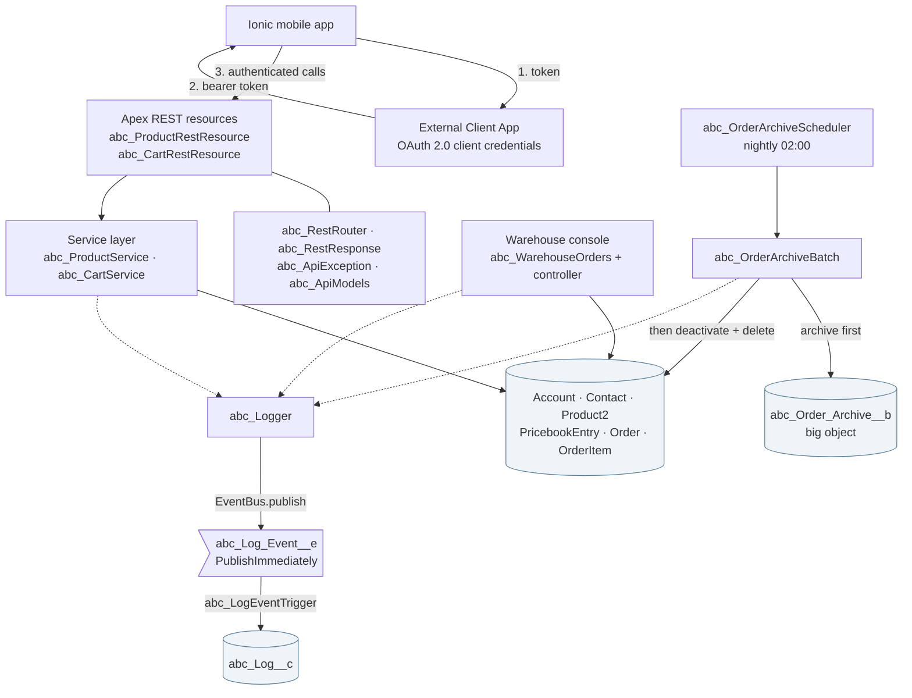
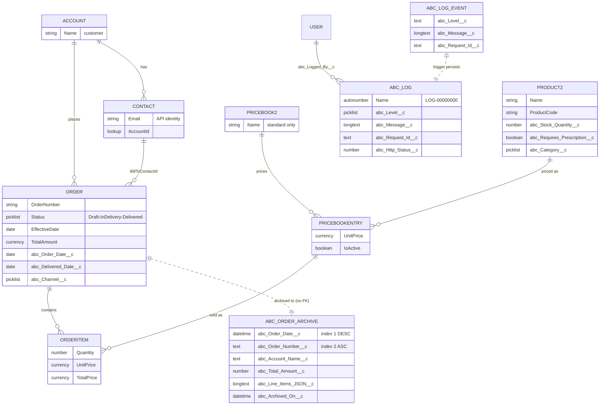
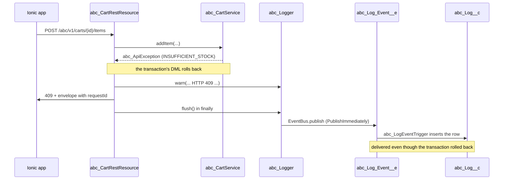

<!-- doc-title: ABC Pharmacy on Salesforce -->
<!-- doc-subtitle: Solution documentation — data model, Apex components, and the reasoning behind them -->
<!-- doc-version: 1.0 -->
<!-- doc-author: Youssef Maged — prepared for Cloudastick Systems -->
<!-- doc-toc: true -->

# ABC Pharmacy on Salesforce

## 1. Overview and scope

Pharmacy **ABC** needs a Salesforce environment to manage customers, its product
catalogue and orders. It runs one warehouse with one operator, and it has a
mobile app built in Ionic that must be able to browse the catalogue and build a
shopping cart.

This solution delivers four things:

| # | Deliverable | Where it lives |
|---|---|---|
| 1 | A data model and a Lightning app for customers, products and orders | `abc_Pharmacy_Management` |
| 2 | An Apex REST API for the Ionic app, with error handling and logging | `/services/apexrest/abc/v1/*` |
| 3 | A Visualforce console for the warehouse operator | `abc_WarehouseOrders` |
| 4 | A Batch Apex job archiving year-old delivered orders into a Big Object | `abc_OrderArchiveBatch` → `abc_Order_Archive__b` |

Every API name created for this project is prefixed `abc_`, as the assessment
requires. The only exceptions are the standard objects being extended
(`Order`, `Product2`) and the standard `OrderStatus` value set, none of which
can be renamed.

**Out of scope.** No payment capture, no delivery routing, no customer-facing
community, and no inventory receipting — stock is decremented and corrected,
not purchased. Section 12 lists what a production build would add.

---

## 2. Architecture



Three ideas hold the design together.

**Standard objects first.** Salesforce already models customers, catalogues and
orders. Re-implementing them as custom objects would throw away the order
lifecycle, the price book, `TotalAmount` roll-ups, and every report and page
layout that comes with them. The solution extends the standard objects with
`abc_`-prefixed fields instead.

**A service layer between REST and the database.** The two `@RestResource`
classes do nothing but read the request, call a service and write the envelope.
All rules live in `abc_ProductService` and `abc_CartService`, which can be
tested without constructing a `RestContext` and could be reused by a Lightning
component or a Flow without touching HTTP.

**Logging that survives a rollback.** Business code never inserts a log record.
It buffers a platform event and publishes it once, and a subscriber turns that
into `abc_Log__c`. The reason is in section 7.

---

## 3. Data model

### 3.1 Entity relationships



### 3.2 Objects

| Object | Type | Purpose | Key relationships |
|---|---|---|---|
| `Account` | Standard | The customer. One per person or household. | Parent of Contact and Order |
| `Contact` | Standard | The person. `Email` is the identity the Ionic app matches on. | Child of Account; `Order.BillToContactId` |
| `Product2` | Standard | The catalogue item. | Parent of PricebookEntry |
| `Pricebook2` | Standard | The standard price book only — one price per product. | Parent of PricebookEntry |
| `PricebookEntry` | Standard | Ties a product to a price. | Product2 × Pricebook2; referenced by OrderItem |
| `Order` | Standard | Both the shopping cart (Draft) and the placed order. | Account, Contact, Pricebook2; parent of OrderItem |
| `OrderItem` | Standard | One product line on an order. | Child of Order; references PricebookEntry |
| `abc_Order_Archive__b` | **Big object** | Cold storage for delivered orders older than a year. | None — big objects support no relationships |
| `abc_Log_Event__e` | **Platform event** | Transport for a log entry. | Consumed by `abc_LogEventTrigger` |
| `abc_Log__c` | **Custom object** | The persisted application log. | Lookup to User |

### 3.3 Custom fields

**Product2**

| Field | Type | Purpose |
|---|---|---|
| `abc_Stock_Quantity__c` | Number(18,0), default 0 | Units in the warehouse. Returned by the API so the app can hide or flag what it cannot sell. |
| `abc_Requires_Prescription__c` | Checkbox | Lets the app prompt for a prescription upload. |
| `abc_Category__c` | Picklist (restricted): Medicine, Supplement, Personal Care, Medical Device | Merchandising grouping and the `category` API filter. |

**Order**

| Field | Type | Purpose |
|---|---|---|
| `abc_Order_Date__c` | Date, default `TODAY()` | The date the customer placed the order. This is the age the archival batch measures. |
| `abc_Delivered_Date__c` | Date | When the order reached the customer. |
| `abc_Channel__c` | Picklist (restricted): Manual, Ionic App | Separates app traffic from counter sales. Orders created through the REST API are stamped `Ionic App`. |

**Order.Status** gains two values beyond the platform's Draft and Activated:
**In delivery** and **Delivered**. Both are mapped to the **Activated** status
code — see section 3.5.

**`abc_Order_Archive__b`** (big object). Index: `abc_Order_Date__c` DESC, then
`abc_Order_Number__c` ASC.

| Field | Type | Notes |
|---|---|---|
| `abc_Order_Date__c` | DateTime, required | Index field 1. DateTime because big objects have no Date type. |
| `abc_Order_Number__c` | Text(30), required | Index field 2. |
| `abc_Order_Id__c` | Text(18) | The id the order held before deletion. |
| `abc_Account_Id__c` / `abc_Account_Name__c` | Text(18) / Text(255) | Customer, denormalised so the archive reads on its own. |
| `abc_Status__c` / `abc_Channel__c` | Text(40) | Snapshot at archival time. |
| `abc_Effective_Date__c` / `abc_Delivered_Date__c` | DateTime | |
| `abc_Total_Amount__c` | Number(16,2) | Number, not Currency — big objects have no Currency type. |
| `abc_Line_Items_JSON__c` | LongTextArea(131072) | The order's lines as JSON. |
| `abc_Archived_On__c` | DateTime | When the batch wrote the row. |

**`abc_Log__c`** — name is an auto-number `LOG-{00000000}`; fields
`abc_Level__c` (DEBUG/INFO/WARN/ERROR), `abc_Source__c`
(REST/Batch/Trigger/Visualforce/Other), `abc_Message__c`,
`abc_Stack_Trace__c`, `abc_Class__c`, `abc_Method__c`, `abc_Record_Id__c`,
`abc_Request_Id__c`, `abc_Quiddity__c`, `abc_Http_Status__c`,
`abc_Timestamp__c`, `abc_Logged_By__c` (lookup to User).
`abc_Log_Event__e` carries the same fields, with the user as text
(`abc_Logged_By_Id__c`) because platform events cannot hold lookups.

### 3.4 Validation rules

| Object | Rule | Why |
|---|---|---|
| `Product2` | `abc_Stock_Quantity_Not_Negative` | A warehouse cannot hold negative units. Guards manual edits and the trigger-driven decrement. |
| `Order` | `abc_Order_Date_Not_In_Future` | An order cannot be placed in the future; keeps the one-year archival window honest. |
| `Order` | `abc_Effective_Date_Not_Before_Order_Date` | An order cannot take effect before it was placed. Both dates appear side by side on the warehouse console, so an inverted pair would be visibly wrong. |

### 3.4a Declarative automation

One record-triggered flow, `abc_Order_Set_Delivered_Date`: a **before-save** flow on
Order that stamps `abc_Delivered_Date__c` with today when an order first reaches
Delivered without one. Before-save is the important part — the field is set on the
record already being written, so there is no second DML and no recursion to guard
against.

### 3.5 Design decisions and assumptions

**A cart is a Draft Order, not a separate object.** Salesforce already gives an
order a draft state in which lines can be added and removed freely. Introducing
an `abc_Cart__c` object would mean copying data at checkout, and a copy can
fail halfway. Here, checkout is a status change on the record that already
exists: nothing moves, and there is no window in which a cart and its order can
disagree. It also means the warehouse sees a live cart in the same list as
everything else.

**Account + Contact rather than Person Accounts.** Person Accounts are not
enabled in a Developer Edition org by default and cannot be turned off once on.
A retail pharmacy customer maps cleanly to an Account with one Contact, and the
Ionic app identifies people by email, which lives on Contact.

**One price book.** ABC has a single retail price per product. Using only the
standard price book removes an entire dimension of configuration, and
`Order.Pricebook2Id` still has to be set for line items to be addable at all.

**`abc_Order_Date__c` is distinct from the standard `EffectiveDate`.** The
assessment asks the warehouse console to show the *effective date*, and asks the
batch to age orders by *Order Date*. Those are different business facts — when
the order takes commercial effect versus when the customer placed it — so they
are different fields. Conflating them would make the archival rule depend on a
date the warehouse can edit.

**Custom statuses are mapped to the Activated status code.** Salesforce groups
every order status under one of two codes, Draft or Activated. "In delivery"
and "Delivered" are both mapped to Activated, which is what makes the platform
freeze the line items once fulfilment has begun — a picker cannot quietly add a
product to an order that is already on a van. The cost is that an activated
order cannot be deleted until its status is set back to a Draft-coded value,
which is exactly what the archival batch does before deleting.

**The archive is one big-object row per order, with line items as JSON.** Big
objects support neither master-detail nor lookup relationships, so a
parent/child archive is not available. Two rows for one order could also be
written half-successfully. Keeping the lines inside the parent row makes an
archived order atomic: one `insertImmediate` either archives the whole order or
none of it.

**The archive index is `[Order Date DESC, Order Number ASC]`.** Big object
queries must filter the index fields in index order, so the first field decides
how the archive can be browsed — by period, which is how anyone looks for an
old order. Order number makes the pair unique, which means re-running the batch
over an already-archived order overwrites the same row instead of duplicating
it. **A big object index cannot be changed after deployment**, so this was
settled before the first deploy.

**Field-level security is delivered as permission sets, never profile edits.**
Fields deployed through the Metadata API arrive with no FLS for anybody,
including a System Administrator. Granting it through three named permission
sets keeps the solution installable into an org whose profiles are already
managed by someone else.

---

## 4. Apex components

### 4.1 Classes

| Class | Type | Responsibility | Tested by |
|---|---|---|---|
| `abc_Logger` | Logging | Buffers `abc_Log_Event__e` entries and publishes them in one flush. Captures request id, quiddity, user and HTTP status; truncates rather than losing data; never throws. | `abc_LoggerTest` |
| `abc_LogEventTriggerHandler` | Logging | Turns delivered events into `abc_Log__c` rows. Partial-success insert, and an unusable user id is dropped rather than failing the batch. | `abc_LoggerTest` |
| `abc_ApiException` | REST | The one exception the API throws on purpose. Owns the error-code → HTTP-status contract. | `abc_RestResponseTest` |
| `abc_RestResponse` | REST | The single writer of the response envelope. Uses `JSONGenerator` so `data: null` and `errors: []` are always present. | `abc_RestResponseTest` |
| `abc_ApiModels` | REST | The wire contract: request classes for strict parsing, DTOs for responses. No SObject ever reaches the client. | (exercised throughout) |
| `abc_RestRouter` | REST | Normalises `requestURI` — apexrest prefix, trailing slashes, query strings — and reads typed query parameters. | `abc_RestRouterTest` |
| `abc_ProductService` | Service | The catalogue: search, category, stock and paging, as a bind-variable-only dynamic query. | `abc_ProductServiceTest` |
| `abc_CartService` | Service | Cart lifecycle: find-or-create customer, create, read, add item with quantity merge, checkout. | `abc_CartServiceTest` |
| `abc_ProductRestResource` | REST | `GET /abc/v1/products`. | `abc_ProductRestResourceTest` |
| `abc_CartRestResource` | REST | The four cart routes, dispatched from one `@HttpPost` and one `@HttpGet`. | `abc_CartRestResourceTest` |
| `abc_WarehouseOrdersController` | Visualforce | Reads every order with its line items and resolves each row's icon. | `abc_WarehouseOrdersControllerTest` |
| `abc_IOrderArchiver` | Batch | The seam between the batch and the big object. Exists so the batch is testable — see section 8.3. | — (interface) |
| `abc_BigObjectOrderArchiver` | Batch | The production writer: `Database.insertImmediate`. | `abc_BigObjectOrderArchiverTest` |
| `abc_OrderArchiveBatch` | Batch | Selects, maps, archives, deactivates, deletes, and reports. `Database.Stateful`. | `abc_OrderArchiveBatchTest` |
| `abc_OrderArchiveScheduler` | Batch | `Schedulable` wrapper for the nightly run. | `abc_OrderArchiveSchedulerTest` |

### 4.2 Test classes and helpers

| Class | Purpose |
|---|---|
| `abc_TestDataFactory` | Shared fixtures. Encapsulates the awkward parts of the order model in one place: insert as Draft with a price book, attach items, then move status; and `Test.setCreatedDate` for backdating. |
| `abc_FakeOrderArchiver` | Test double for `abc_IOrderArchiver`. Records rows, can fail selected orders, throw, or return a mismatched result count. |
| `abc_LoggerTest` · `abc_RestResponseTest` · `abc_RestRouterTest` · `abc_ProductServiceTest` · `abc_CartServiceTest` · `abc_ProductRestResourceTest` · `abc_CartRestResourceTest` · `abc_WarehouseOrdersControllerTest` · `abc_OrderArchiveBatchTest` · `abc_BigObjectOrderArchiverTest` · `abc_OrderArchiveSchedulerTest` | See section 8. |

### 4.3 Triggers, pages and other components

| Component | Type | Notes |
|---|---|---|
| `abc_LogEventTrigger` | Trigger on `abc_Log_Event__e` (after insert) | One line; all logic in the handler so it is directly unit testable. |
| `abc_WarehouseOrders` | Visualforce page | SLDS, `apex:repeat`, ~25 lines of plain JavaScript for row expansion. |
| `abc_Warehouse_Orders` | Custom tab | Surfaces the page in the Lightning app. |
| `abc_Log__c` | Custom tab | With list views `abc Recent Errors` and `abc All Logs`. |
| `abc_Pharmacy_Management` | Lightning app | Home, Accounts, Contacts, Products, Orders, Warehouse Orders, abc Logs. |
| `abc_Order_Set_Delivered_Date` | Record-triggered Flow | Before-save on Order: when an order first reaches Delivered with no delivered date, stamps today. |
| `abc_Pharmacy_Admin` · `abc_Warehouse_User` · `abc_API_Integration` | Permission sets | Section 9. |

---

## 5. The REST API

Full reference, with request and response examples, is in
**`API_DOCUMENTATION.md`**. In summary:

| Method and path | Purpose | Success |
|---|---|---|
| `GET /abc/v1/products` | Catalogue, with `search`, `category`, `includeOutOfStock`, `limit`, `offset` | 200 |
| `POST /abc/v1/carts` | Create a cart; find or create the customer by email | 201 |
| `GET /abc/v1/carts/{cartId}` | Read a cart | 200 |
| `POST /abc/v1/carts/{cartId}/items` | Add a product, merging quantity if it is already in the cart | 200 |
| `POST /abc/v1/carts/{cartId}/checkout` | Place the order | 200 |

Every response, success or failure, uses one envelope:

```json
{ "success": true, "data": { }, "errors": [], "requestId": "4Zx..." }
```

The client parses one shape and never branches on status code to find the
payload. `requestId` is the platform request id that `abc_Logger` stamps on
every log entry raised in the same transaction, so a request id quoted in a
support ticket resolves directly to the rows that explain it.

Three implementation choices are worth calling out.

**Strict JSON parsing.** Bodies are read with `JSON.deserializeStrict` against
explicit request classes. A misspelled attribute — `quantityy` instead of
`quantity` — is rejected as `MALFORMED_JSON` rather than being silently ignored
and then failing later as "quantity is required", which is far harder for a
mobile developer to diagnose.

**Routing on the path.** Apex REST allows one `@HttpPost` and one `@HttpGet`
per class, so `abc_CartRestResource` dispatches its four routes on the part of
the URI after the base path. `abc_RestRouter` absorbs the fact that
`requestURI` arrives with or without the `/services/apexrest` prefix, with or
without a trailing slash, and sometimes with a query string still attached. An
unrecognised path returns 404 `ROUTE_NOT_FOUND` listing the valid routes,
rather than falling through to something surprising.

**Queries are bound, never concatenated.** `abc_ProductService` builds its SOQL
dynamically to apply optional filters, but every caller value goes in through
`Database.queryWithBinds`. A test asserts that a search term containing quote
characters returns no rows instead of altering the query.

---

## 6. The warehouse console

`abc_WarehouseOrders` lists every order — number, status, effective date,
customer, total — with an icon before the order number and a row that expands
to show the products to pick, with quantity and unit price.

### 6.1 The icon rule, and why precedence had to be decided

The assessment specifies four icons:

| Condition | Icon |
|---|---|
| Order created today | ⏳ hourglass with flowing sand |
| Order created before today | ⌛ hourglass done |
| Status "In delivery" | 🚚 delivery truck |
| Status "Delivered" | ✅ white heavy check mark |

These rules overlap: an order that is Delivered was also created on some day, so
a status rule and a date rule both match the same record. The requirement does
not say which wins, so the decision is made once, in
`abc_WarehouseOrdersController`, and **stated in a legend on the page itself**:

> **Delivered → ✅; else In delivery → 🚚; else created today → ⏳; else ⌛.**

Status beats date because of what the operator uses the list for. Fulfilment
state is the actionable signal — is this mine to pick, is it on the road, is it
finished — while the age of the order is context. An order delivered this
morning is finished business, and showing it as "created today" would hide that.
The rule is total and mutually exclusive, so every row gets exactly one icon,
and the status is also spelled out in its own column so the icon is never the
only carrier of meaning.

### 6.2 Implementation notes

The emoji are emitted as **HTML numeric character entities** (`&#x23F3;`,
`&#x231B;`, `&#x1F69A;`, `&#x2705;`) rather than literal characters. Visualforce
markup, the Metadata API and the file encodings in between all handle ASCII
entities predictably, whereas a literal astral-plane character such as the truck
can survive or not survive a round trip depending on which tool touched the file
last.

Row expansion is one delegated click listener in plain JavaScript — no library,
no inline `onclick` — so nothing trips the org's content security policy. The
toggle maintains `aria-expanded` and `aria-controls`.

`apex:repeat` renders at most 1000 items, so the query is capped at 1000 and
ordered newest first. When the cap is reached the page says so rather than
silently truncating the warehouse's work list.

---

## 7. Logging and error handling



Business code never inserts `abc_Log__c`. It calls
`abc_Logger.debug/info/warn/error(...)`, which buffers an `abc_Log_Event__e`,
and the handler calls `abc_Logger.flush()` once in a `finally` block.

**Why the indirection.** The transaction you most need a log for is the one that
failed and rolled back — and an ordinary `insert` would roll back with it,
destroying the evidence. `abc_Log_Event__e` is declared
`PublishImmediately`, which means the platform delivers it regardless of what
the surrounding transaction goes on to do.

Other properties worth noting:

- **Correlation.** Every entry carries `Request.getCurrent().getRequestId()`, and
  the API returns the same value in every response envelope.
- **Levels and source.** Client mistakes (4xx) are logged as WARN, server faults
  (5xx) as ERROR, so `abc Recent Errors` is not drowned in user typos.
- **Nothing leaks.** A 500 tells the caller only that the request could not be
  completed, and to quote the requestId. The exception type, message and stack
  trace stay in `abc_Log__c`.
- **The logger never throws.** A failure to log must not become the error the
  caller sees; publish failures fall back to the debug log.
- **Bounded.** The buffer caps at 250 entries per transaction, so a runaway loop
  cannot turn one failed request into a platform-event limit breach.

---

## 8. Archival

### 8.1 What it does

`abc_OrderArchiveBatch` selects every Order whose `Status` is **Delivered** and
whose `abc_Order_Date__c` is **more than one year old**, writes one
`abc_Order_Archive__b` row per order with its line items serialised to JSON, and
then removes the order from Salesforce.

`abc_OrderArchiveScheduler` runs it nightly at 02:00 under the job name
`abc_Order_Archive_Nightly` — outside the warehouse's working day and away from
the app's traffic, because the job deletes records.

### 8.2 The order of operations inside `execute()`

The three steps are in a specific and non-obvious order:

1. **Archive first.** `Database.insertImmediate` is treated by the platform as a
   callout. If any sObject DML — or an `EventBus.publish` — has already happened
   in the transaction, it fails with "uncommitted work pending".
2. **Then set the status back to Draft and delete.** An Activated-coded order
   cannot be deleted, and Delivered is Activated-coded.
3. **Flush the log last**, because publishing events is itself DML.

Failures are isolated per order: a row whose archive write fails is left in
place and logged, and the others still go. Because the archive is keyed on
`(order date, order number)`, a re-run overwrites the same row rather than
duplicating it, so retrying is safe.

### 8.3 Why the writer is injected

**Salesforce does not allow big object DML inside an Apex test.**
`Database.insertImmediate` from a test context raises
`System.UnexpectedException: Internal Salesforce.com Query Error` — verified
against this org, both inside and outside a `Test.startTest()` boundary — and
that exception **cannot be caught**, so the call cannot even be wrapped and
tolerated.

The batch has to do both a big object write and ordinary sObject DML in one
transaction, so without a seam none of its behaviour could be tested at all.
`abc_IOrderArchiver` is that seam: production runs
`abc_BigObjectOrderArchiver`, tests run `abc_FakeOrderArchiver`, and the real
write is proved against the org by
`scripts/apex/abc_run_archive_now.apex` followed by
`scripts/apex/abc_query_archive.apex` — a documented step in the runbook, and
one that has been run (section 11).

### 8.4 Reading the archive

Big object SOQL is not ordinary SOQL, and `abc_query_archive.apex` shows the
three rules it has to obey: filter the index fields **in index order**, no
aggregate functions (`SELECT COUNT()` fails outright), and no `!=` or `LIKE`.
The idiom for "everything" is a wide range filter on the first index field.

---

## 9. Security model

Access is delivered entirely through permission sets. No profile is modified.

| Permission set | For | Objects | Notable permissions |
|---|---|---|---|
| `abc_Pharmacy_Admin` | Business administrators | Full CRUD on Account, Contact, Product2, Order, OrderItem, `abc_Log__c`; read/create/delete on the archive | Activate Orders, Edit Activated Orders, API Enabled; all `abc_` classes; both tabs; the app |
| `abc_Warehouse_User` | The warehouse operator | **Read + Edit** on Order and OrderItem; **Edit** on `Product2.abc_Stock_Quantity__c`; read-only on customers and the rest of the catalogue; **no delete anywhere**; **no access to the log** | Edit Activated Orders (+ Activate Orders, which Salesforce requires as its prerequisite); the Visualforce page and its controller only |
| `abc_API_Integration` | The Ionic app's run-as identity | Create/edit Account, Contact, Order, OrderItem; read Product2 and pricing; edit stock | API Enabled, Activate Orders; the REST classes and what they call — no Visualforce, no log, no delete except order lines |

The warehouse set is the interesting one: it grants exactly what the assessment
describes — "view the orders to commence the outbound deliveries and quantity
change updates" — and nothing more. It cannot create an order, cannot delete
anything, and cannot see the application log. `ActivateOrder` appears only
because Salesforce refuses `EditActivatedOrders` without it; since the operator
cannot create orders, activation in practice only ever means moving an order
the pharmacy already took into "In delivery" and then "Delivered". That
constraint is recorded inline in the permission set file.

Apex enforces the same boundary rather than relying on the UI: services are
`with sharing`, SOQL runs `WITH USER_MODE`, and DML runs at
`AccessLevel.USER_MODE`. `abc_WarehouseOrdersControllerTest` proves it, by
running the controller inside `System.runAs` for a Standard User holding nothing
but `abc_Warehouse_User`.

The one deliberate exception is `abc_LogEventTriggerHandler`, which is
`without sharing`: the platform-event subscriber runs as the Automated Process
user, and a log must be written regardless of who raised it. It copies a payload
and reads no business data.

---

## 10. Salesforce features used, and why

| Feature | Where | Why this rather than something else |
|---|---|---|
| **Standard Order model** (Order, OrderItem, Pricebook) | The core | Brings the draft/activated lifecycle, `TotalAmount` roll-ups and line-item locking for free. Custom objects would mean rebuilding all of it. |
| **Lightning App** | `abc_Pharmacy_Management` | Puts the business user's six screens behind one navigation bar instead of leaving them to hunt through the app launcher. |
| **Permission Sets** | Three | Additive and removable. A profile edit is a change to the org that is hard to reverse and hard to review. |
| **Validation Rules** | Three | Data integrity enforced by the platform, so it applies to the UI, the API and the data loader alike — nobody can route around it. |
| **Apex REST** | Two resources | The Ionic app needs endpoints shaped around a cart, not around SObjects. Composite/standard REST would have made the app orchestrate order → price book → line items itself. |
| **External Client App + OAuth 2.0** | `abc_Ionic_App` | The current way to register an API client; classic Connected Apps are disabled for new orgs. Client credentials keeps the reviewer's setup to one token call. |
| **Platform Events** | `abc_Log_Event__e` | The only mechanism that gets a log out of a transaction that then rolls back. |
| **Custom Object** | `abc_Log__c` | Makes logs reportable, list-viewable and queryable by requestId — a debug log is none of those. |
| **Big Object** | `abc_Order_Archive__b` | Exactly the requirement, and the right tool: unlimited, cheap, indexed storage for records you keep but rarely read. |
| **Batch Apex + Schedulable** | `abc_OrderArchiveBatch` | Archival is unbounded over time; batch chunking is what keeps it inside governor limits as the order history grows. |
| **Record-Triggered Flow** | `abc_Order_Set_Delivered_Date` | A before-save flow is the cheapest thing on the platform that can default one field on the record being saved — no query, no DML, no Apex to maintain. Keeping it declarative also lets the pharmacy change the rule without a deployment. Apex would have been the wrong tool. |
| **Visualforce + SLDS** | `abc_WarehouseOrders` | Requested explicitly. `apex:slds` keeps it visually native to Lightning without hand-written CSS. |
| **Custom Tabs** | Two | Surfaces the page and the log inside the app. |

---

## 11. Deployment and operations runbook

### 11.1 Deploy into a fresh org

```bash
sf org login web --alias abcDev --set-default
sf project deploy start --source-dir force-app
sf org assign permset --name abc_Pharmacy_Admin
sf org assign permset --name abc_Warehouse_User
sf org assign permset --name abc_API_Integration
```

One thing to know before the second deploy: **a scheduled Apex job blocks Apex
deployments.** Once `abc_Order_Archive_Nightly` exists, Salesforce refuses to
deploy any Apex class while that job is pending — and because a deploy is all or
nothing, one scheduled job blocks the whole source directory, not just the batch.
`force-app/main/default/settings/Deployment.settings-meta.xml` turns on *Allow
deployments of components when corresponding Apex jobs are pending or in
progress*, which is the supported remedy; it is deployed as part of the source,
so a first deploy into a fresh org sets it before anything is scheduled. The
alternative — unschedule before every deploy, reschedule afterwards — is a trap
for whoever deploys next.

Two settings must be enabled in Setup by hand — neither is exposed to the
Metadata API:

1. **User Interface → "Set Audit Fields upon Record Creation"**, so the seed
   script can backdate `CreatedDate` and the console can show an order created
   before today. Until it is on, the `CreateAuditFields` permission does not
   exist in the org at all — which is why `abc_Pharmacy_Admin` grants it and
   `abc_seed_data.apex` writes the field through `put()` rather than as a field
   assignment, the static form being a compile error while the setting is off.
2. **Deliverability → All email**, so the reviewer's password reset can be sent.

And the API client is registered in **Setup → External Client App Manager**:
name `abc_Ionic_App`, Local distribution, OAuth enabled, callback
`https://localhost/callback`, scope `api`, **Client Credentials Flow** enabled,
and under **Policies** a **Run As** user holding `abc_API_Integration`. The
consumer key and secret are revealed on the app's Settings tab.

### 11.2 Seed and demonstrate

```bash
sf apex run --file scripts/apex/abc_deactivate_sample_products.apex  # retire the DE sample catalogue
sf apex run --file scripts/apex/abc_seed_data.apex            # catalogue, customers, 5 orders
sf apex run --file scripts/apex/abc_schedule_archive.apex     # nightly job at 02:00
sf apex run --file scripts/apex/abc_run_archive_now.apex      # archive now
sf apex run --file scripts/apex/abc_query_archive.apex        # read the archive back
sf apex run --file scripts/apex/abc_seed_archivable_order.apex # re-arm the demo
```

The seed creates five orders chosen to exercise every behaviour: an open Draft
cart, an Activated order, one In delivery, one Delivered recently, and one
Delivered over a year ago for the batch to find.

Run `abc_deactivate_sample_products.apex` **first**, and in every fresh org.
`abc_ProductService` defines the catalogue as "active product with an active
entry in the standard price book" — the correct definition for a real org, and
one that lets a new pharmacy line be added without a code change. A Developer
Edition org, however, ships with its own sample catalogue of GenWatt generators,
SLAs and Installations, and those records satisfy that definition too. They stay
out of the default listing only because their `abc_Stock_Quantity__c` is null
and `null > 0` is false in SOQL; call `GET /abc/v1/products?includeOutOfStock=true`
and a pharmacy starts advertising diesel generators. Deactivating them fixes the
data rather than narrowing the service to a product-code prefix.

### 11.3 Verified in this org

| Check | Result |
|---|---|
| `sf project deploy start --source-dir force-app` | Succeeds — 92/92 components, 0 errors, with the nightly job scheduled |
| `sf apex run test --test-level RunLocalTests --code-coverage` | **133 tests, 100% passing, 91% org-wide coverage** |
| Order status codes | `Draft`→Draft; `Activated`, `In delivery`, `Delivered`→Activated |
| Warehouse console | Renders with legend; **all four icons** correct against seeded data — ⏳ created today, ⌛ created earlier, 🚚 in delivery, ✅ delivered |
| Archival batch | `AsyncApexJob` Completed, 0 errors; order 00000104 archived with all three line items as JSON and deleted from Order; the recent Delivered order untouched |
| Nightly schedule | `abc_Order_Archive_Nightly`, `0 0 2 * * ?`, state WAITING |
| Delivered-date flow | Moving an order to Delivered with no delivered date stamps today; verified against the org |

---

## 12. Testing

133 tests, 100% passing, **91% org-wide coverage**.

| Class | Coverage |
|---|---|
| `abc_ApiException` · `abc_ApiModels` · `abc_LogEventTrigger` · `abc_LogEventTriggerHandler` · `abc_OrderArchiveScheduler` · `abc_WarehouseOrdersController` | 100% |
| `abc_RestRouter` | 98% |
| `abc_RestResponse` | 96% |
| `abc_ProductService` | 95% |
| `abc_Logger` | 92% |
| `abc_CartService` | 91% |
| `abc_OrderArchiveBatch` | 86% |
| `abc_ProductRestResource` | 82% |
| `abc_CartRestResource` | 80% |
| `abc_BigObjectOrderArchiver` | 75% — see below |

The tests are written to assert behaviour rather than implementation: error
cases assert the specific error **code**, because those codes are a published
contract with the Ionic developers and a silent change from 409 to 400 would
break them.

A few tests exist specifically to pin platform behaviour the design depends on —
that Salesforce refuses to activate an order with no products, that a quote
character in a search term cannot alter the SOQL, that a cart which has left
Draft is frozen.

`abc_BigObjectOrderArchiver` sits at 75% because its single
`Database.insertImmediate` statement is unreachable from a test (section 8.3).
That line is proved against the org instead.

---

## 13. Reviewer access

A System Administrator user has been created for Cloudastick:

| | |
|---|---|
| Username | `assessments@cloudastick.com.orgfarm-ad027e59fe` |
| Email | `assessments@cloudastick.com` |
| Profile | System Administrator |
| Licence | Salesforce |
| Permission sets | `abc_Pharmacy_Admin`, `abc_Warehouse_User` |

The password is supplied in the submission email rather than written here, and
deliberately not committed to this repository. It was set with
`System.setPassword`, not `System.resetPassword`, so there is no 24-hour link to
race and no forced change on first login.

On the first login from a new location Salesforce will email a verification code
to `assessments@cloudastick.com`. That is by design - the assessment asks for a
reviewer account that works **without** access to the author's personal
verification codes, and this account's codes go to Cloudastick's own mailbox.

Once in: open the **ABC Pharmacy Management** app, then the **Warehouse Orders**
tab for the console and **abc Logs** for the application log.

The Postman collection in `postman/` covers every endpoint. Import the
collection and the environment, set the consumer key and secret, and run the
**Get token** request first — everything else picks the token up automatically.

---

## 14. Known limitations and future work

**Limitations of this build**

- **Big object writes are untestable in Apex.** Covered in section 8.3; the real
  write is verified by a runbook script instead.
- **Seeding a "created before today" order needs an org setting.** The ⌛ rule
  keys on `CreatedDate`, which can only be written when *Set Audit Fields upon
  Record Creation* is enabled — it is, in this org, and the seed data exercises
  all four icons. In an org where it is off, `abc_seed_data.apex` detects that
  and carries on without backdating, so every seeded order reads as created
  today. The rule itself is unit tested independently with `Test.setCreatedDate`.
- **Client-credentials OAuth.** Chosen so a reviewer needs one token call. A
  production Ionic app should use Authorization Code with PKCE, so that actions
  are attributed to the real customer rather than to a shared integration user.
- **No stock decrement on checkout.** Stock is validated against the cart but
  not reserved, so two customers can both be told the last unit is available. A
  production build would decrement on activation and hold stock for the life of
  a cart.
- **The warehouse console lists 1000 orders.** Enough for a single-warehouse
  pharmacy; beyond that it needs paging or a date filter.
- **Developer Edition constraints.** Two Salesforce licences remain free, which
  is enough for the reviewer and one warehouse user. Salesforce Platform
  licences cannot access Order or Product2 at all, so a real warehouse-only user
  would still need a full licence.

**What a production build would add**

- Authorization Code + PKCE, or a backend-for-frontend that holds the secret.
- Stock reservation, with a cart expiry that releases it.
- Prescription upload and pharmacist approval for `abc_Requires_Prescription__c`
  products.
- Delivery routing and driver assignment, replacing the single "In delivery"
  status with real fulfilment tracking.
- A retention policy for `abc_Log__c` — platform-event logging is cheap to write
  and will grow without one.
- Rate limiting on the API, and idempotency keys on checkout.
